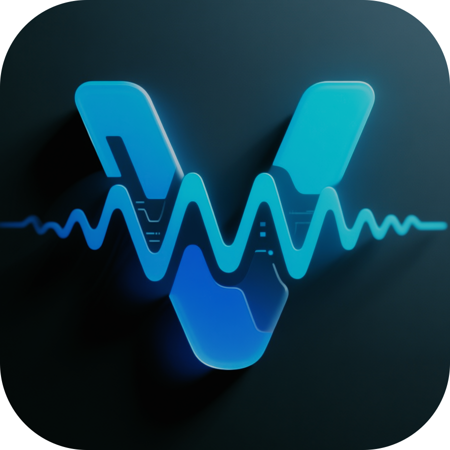

# Vela Spectrum

> 🌌 Тема цвета будущего: глубокая, живая, интеллектуальная.
## 🎨 Превью



## 💡 Цветовая палитра

- **Акцент**: `#4F46E5` (фиолетовый)
- **Успех**: `#10B981` (зелёный)
- **Ошибка**: `#EF4444` (красный)
- **Предупреждение**: `#F59E0B` (жёлтый)
Vela Spectrum — это **современная тема для VS Code**, построенная на **OKLCH** и **семантических цветах**, с полной поддержкой **AI, Copilot, GitHub, Accessibility** и **режимов для дальтоников**.

Она не просто красивая — она **умная**.
Она не просто светлая/тёмная — она **адаптивная**.
Она не просто тема — она **экосистема**.

---

## 🎨 Особенности

✅ **Полная поддержка AI и Copilot**
Подсветка чата, лампочек, встроенного редактирования, inlay hints — всё с акцентом на интеллектуальность.

✅ **9 режимов цвета**
- `normal`, `dimmed`, `highContrast`
- `colorblind`, `tritanopia`
- `light`, `dark`, `auto`
- `ai` (эксклюзивный режим с фиолетовыми акцентами)

✅ **Глубокая настройка подсветки кода**
Тысячи токенов: `syntax.function`, `syntax.constant`, `syntax.local`, `syntax.decorator` — всё стилизовано.

✅ **Цветные скобки и направляющие**
`editor.bracketPairColorization.enabled` — включено и красиво.

✅ **Поддержка терминала, вкладок, панелей**
Цвета для `terminal`, `activityBar`, `titleBar`, `ports`, `merge conflicts` — везде.

✅ **Для дальтоников**
Режимы `colorblind` и `tritanopia` — безопасные цвета, которые не сливаются.

✅ **Оптимизирована для долгой работы**
Мягкие, сбалансированные тона — глаза не устают.

---
## 🖼 Скриншоты

### Темный режим


### Светлый режим


### AI Mode (эксклюзив)


### Цветные скобки


### Подсветка Git-изменений


### Copilot Chat


---

## 🌐 Режимы доступности

### Colorblind (протанопия/дейтеранопия)


### Tritanopia (нарушение синего канала)


### High Contrast (высокий контраст)


---

## 🎨 Дополнительные режимы

### Dimmed (приглушённый)


### AI Mode (фиолетовые акценты)


---

## 🎥 Видео-превью (GIF)

### Темный режим


### Светлый режим


### Colorblind Mode


### AI Mode


---

## ⚙️ Настройки (рекомендуемые)

Добавь в `settings.json`:

```json
{
  "editor.bracketPairColorization.enabled": true,
  "editor.guides.bracketPairs": "active",
  "editor.guides.highlightActiveBracketPair": true,
  "editor.inlineSuggest.enabled": true,
  "editor.lightbulb.enabled": true,
  "workbench.colorTheme": "Vela Spectrum"
}