# Vela Spectrum

> 🌌 Тема цвета будущего: глубокая, живая, интеллектуальная.

### Vela Spectrum

Vela Spectrum — это **личная цветовая система для VS Code**, созданная **для себя**, на основе **собственной библиотеки цветов и принципов восприятия**. Она разработана с учётом реальных условий: долгой работы, разных освещений, использования AI-инструментов.

В отличие от типичных тем, основанных на HEX, она построена на **перцептуально равномерном цветовом пространстве OKLCH**, что обеспечивает:
- Плавные, визуально сбалансированные переходы
- Высокую читаемость без перенасыщенности
- Корректное восприятие при любом освещении

Тема использует **семантический подход к цветам**: каждый оттенок имеет своё назначение (акцент, успех, ошибка, синтаксис), что позволяет гибко настраивать внешний вид под разные режимы и нужды.

---

### Что делает Vela Spectrum особенной?

🔹 **Приоритетный цвет — зелёный**
Основной акцент сделан на **зелёный спектр** — цвет продуктивности, роста и спокойствия. Он мягкий, но заметный, идеально подходит для длительной работы.

🔹 **Глубокая поддержка AI-инструментов**
Полностью стилизована для **GitHub Copilot**, **Inline Chat**, **AI-подсказок** и **inlay hints** — все элементы интерфейса интегрированы в цветовую систему.

🔹 **11 режимов отображения**
Включая:
- `normal`, `dimmed`, `highContrast`
- `colorblind`, `tritanopia`
- `light`, `dark`, `auto`
- эксклюзивный `ai`-режим (**в разработке**)

Каждый режим адаптируется под контекст: от офисного освещения до условий низкой доступности.

🔹 **Доступность как приоритет**
Режимы `colorblind` и `tritanopia` не просто приглушают цвета — они **перестраивают палитру**, чтобы ключевые элементы (ошибки, изменения, акценты) оставались различимыми.

🔹 **Оптимизация для длительной работы**
Темные и светлые тона сбалансированы так, чтобы **снизить усталость глаз**, особенно при работе с большими объёмами кода.

🔹 **Единая экосистема цветов**
Все 10 тем — от `Vela Spectrum Dark+` до `Vela Spectrum Dimmed Light` — созданы на одной архитектуре, что обеспечивает **консистентность** и **прогнозируемость**.

🔹 **Сделано для себя, но открыто для всех**
Эта тема родилась из личной потребности в **комфортной, читаемой и красивой среде**. Она основана на моей **собственной библиотеке цветов**, разработанной годами.

🔹 **Готова к кастомизации**
Хочешь другую цветовую гамму (синюю, фиолетовую, коричневую)? Напиши мне — и я сделаю для тебя **персональную версию** на той же архитектуре.

---

> Она не просто красивая — она **умная**.
> Она не просто светлая или тёмная — она **адаптивная**.
> Она не просто тема — она **экосистема**.

---

## 🔬 Как работает цвет: от OKLCH к HEX

Vela Spectrum строится на **современном цветовом пространстве OKLCH**, которое решает ключевую проблему HEX и HSL: **визуальная неоднородность**.

### Почему OKLCH?

- В HSL/HEX одинаковое изменение числа ≠ одинаковое изменение восприятия
- В OKLCH: **одинаковое изменение = одинаковое восприятие**
- Это позволяет создавать **плавные градиенты**, **точные акценты**, **предсказуемую контрастность**

### Как происходит преобразование?

1. **OKLCH → Linear RGB**
   Цвет в формате `{ l: 0.8, c: 0.2, h: 275 }` преобразуется в линейное RGB через математические формулы (на основе OKLab).
2. **Linear RGB → sRGB**
   Применяется гамма-коррекция для отображения на экранах.
3. **sRGB → HEX**
   Полученные значения (0–1) умножаются на 255 и конвертируются в шестнадцатеричный формат.

> 🔧 Этот процесс выполняется в `ColorConverter.js` с высокой точностью, с учётом:
> - Ограничений sRGB
> - Альфа-канала
> - Семантического связывания

---

## 🖼 Скриншоты

### Vela Spectrum Dark+


### Vela Spectrum Light+


### Vela Spectrum Colorblind
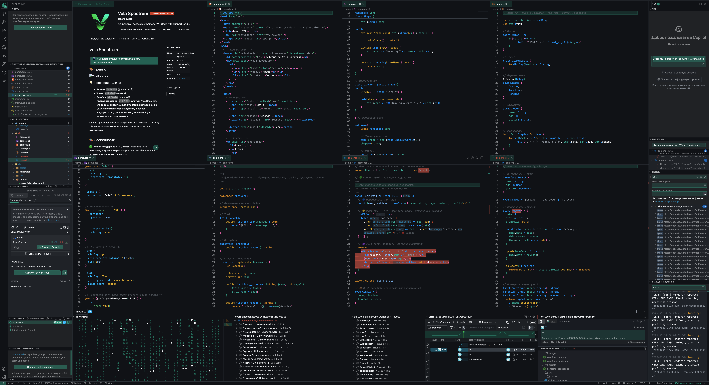

### Vela Spectrum Colorblind Light
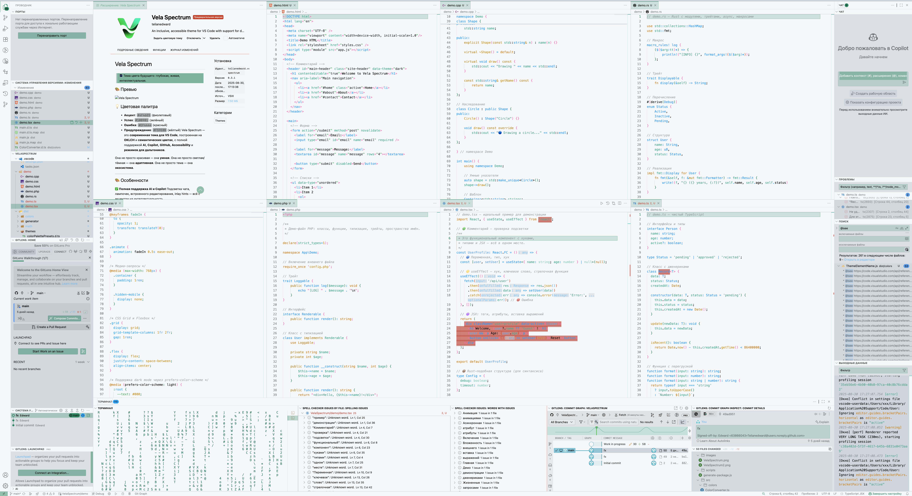

### Vela Spectrum Dimmed


### Vela Spectrum Dimmed Light


### Vela Spectrum High Contrast


### Vela Spectrum High Contrast Light


### Vela Spectrum Tritanopia
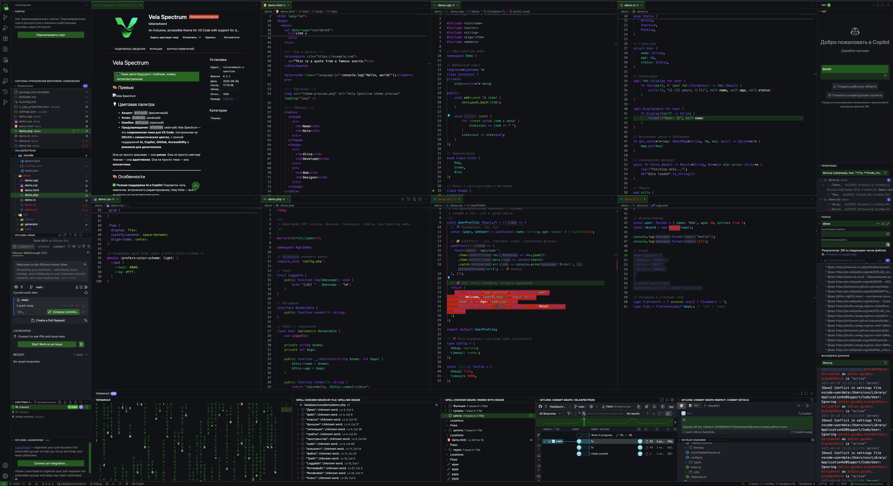

### Vela Spectrum Tritanopia Light
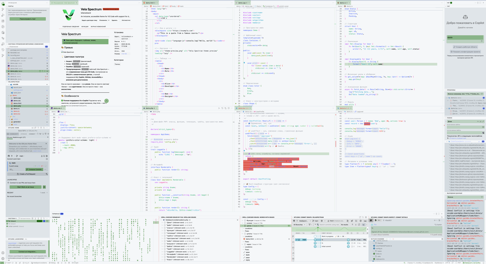

---

## 🎥 Видео-превью (GIF)

### Vela Spectrum Dark+
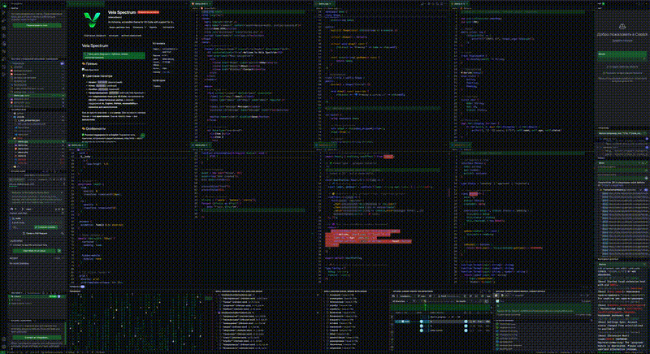

### Vela Spectrum Light+
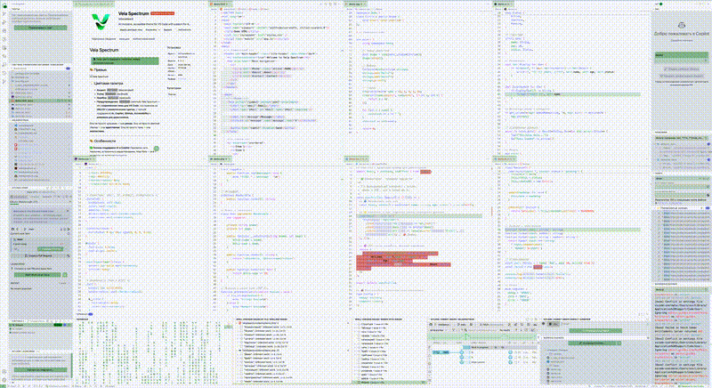

### Vela Spectrum Colorblind
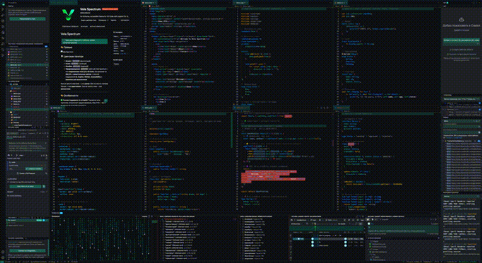

### Vela Spectrum Colorblind Light
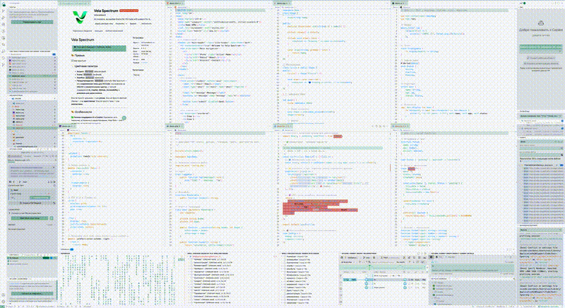

### Vela Spectrum Dimmed
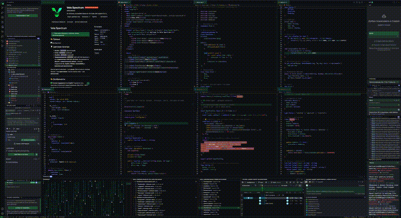

### Vela Spectrum Dimmed Light
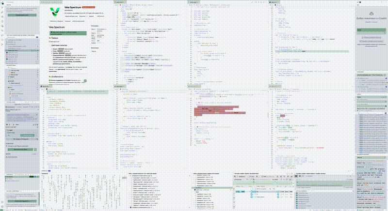

### Vela Spectrum High Contrast
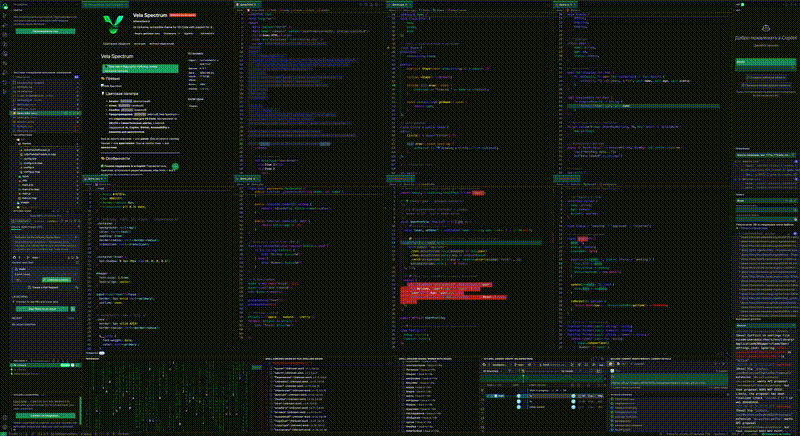

### Vela Spectrum High Contrast Light
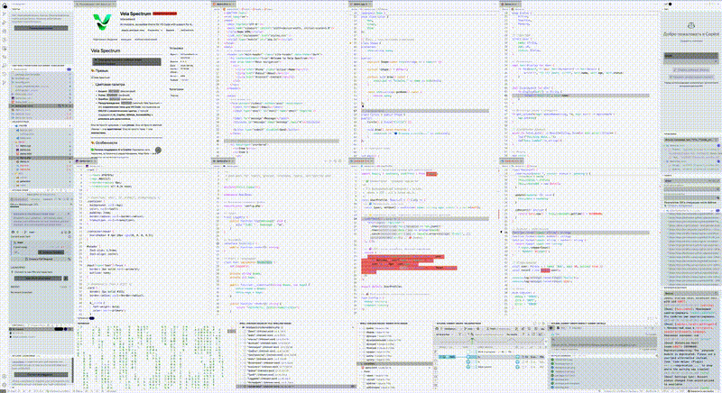

### Vela Spectrum Tritanopia
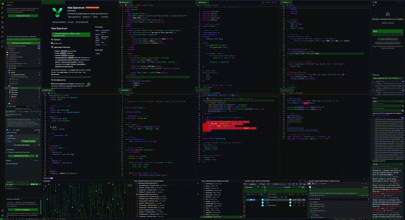

### Vela Spectrum Tritanopia Light
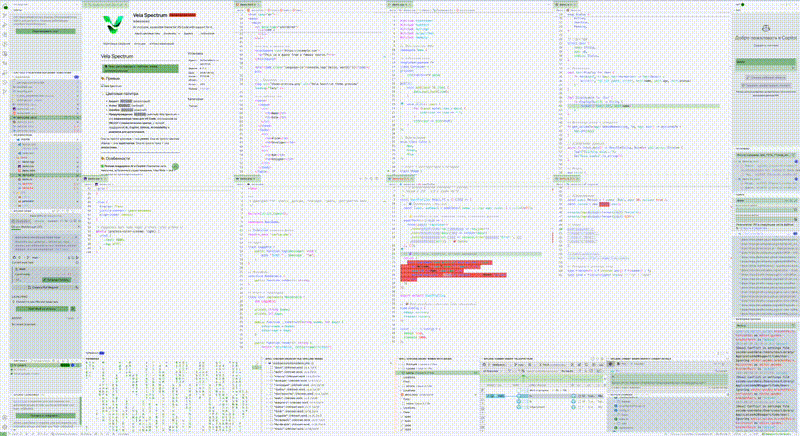

---

## ⚙️ Настройки (рекомендуемые)

Добавь в `settings.json`:

```json
{
  "editor.bracketPairColorization.enabled": true,
  "editor.guides.bracketPairs": "active",
  "editor.guides.highlightActiveBracketPair": true,
  "editor.inlineSuggest.enabled": true,
  "editor.lightbulb.enabled": true,
  "workbench.colorTheme": "Vela Spectrum"
}